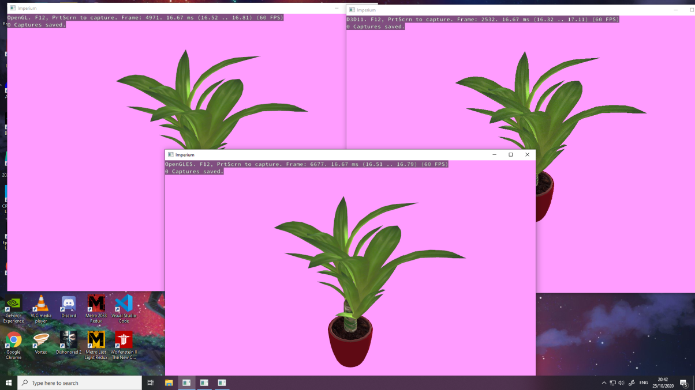

# Imperium

## Introduction

At the time being, this is just a skeleton of a multi-platform rendering engine.

### Graphics techniques

* Deferred rendering
* Programmable RenderGraph
* Cascaded Shadows
* PBR Materials
* Basic skeleton animation

(This repo is a Work-In-Progress. At the time being, we can barely draw a cute textured plant with Phong effect.)

### API support

|               | Linux | Windows | Android |
|---------------|-------|---------|---------|
| OpenGL ES 3.2 |   🚅   |    🚅   |    🚜   |
| OpenGL 3.3    |   🚅   |    🚅   |    ❎   |
| OpenGL 4.6    |   🚂   |    🚂   |    ❎   |
| Vulkan        |   🚧   |    🚧   |    🚧   |
| DirectX 11    |   ❎   |    🚅   |    ❎   |
| DirectX 12    |   ❎   |    🤞   |    ❎   |

* 🚅 Run and build like a charm.
* 🚜 Run like a charm
* ❎ API not shippable.
* 🚂 Not complicated to do, but not the priority.
* 🚧 Don't hesitate to make a pull request lol.
* 🤞 It's a dream but we will get there!

(This repo is a Work-In-Progress.)

## Building

Before building on any platforms, make sure to fetch git submodules.

```shell script
git clone https://github.com/vinhig/Imperium
cd Imperium
git submodule init
git submodule update
```

### Android

Make sure you've installed NDK and Android SDK. glslangValidator has to be installed.

`./gradlew installDebug`

### Linux

GLFW3 and glslangValidator are mandatory dependencies.

```shell script
sudo apt install libglfw-dev glslang-dev glslang-tools # ubuntu 20.04
sudo pacman -S glfw glslang                            # arch linux/manjaro
```

```shell script
mkdir build
cd build
cmake ..
./Imperium
```

### Windows

vcpkg is used to retrieve dependencies.

You have to download glslangValidator and add it to your path.

(DirectX SDK doesn't have a vpckg package. You'll have to install it manually.)

```shell script
vcpkg install glfw3
# clone repo and fetch submodules
mkdir build
cd build
cmake .. -DCMAKE_TOOLCHAIN_FILE="C:\path\to\your\vcpkg\scripts\buildsystems\vcpkg.cmake"
MSBuild.exe Imperium.sln /property:Configuration=Release /property:Platform=x64
./Debug/Imperium.exe
```

## Third party

This project makes heavy use of:

* https://github.com/nem0/OpenFBX
* https://github.com/g-truc/glm
* https://github.com/Dav1dde/glad
* https://github.com/KhronosGroup/SPIRV-Cross

A big thanks to them.
 
## Screenshots



